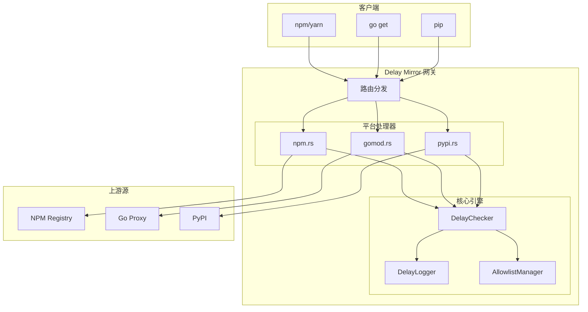
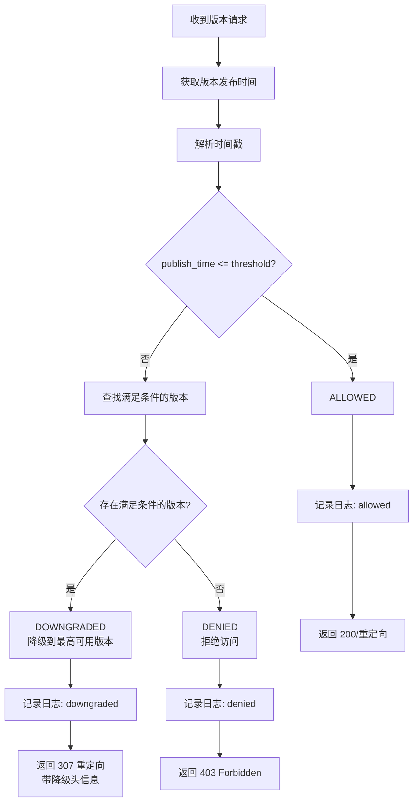
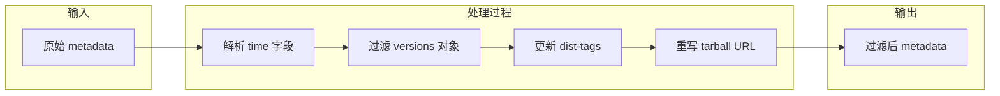

# Delay Mirror 网关架构文档

> 版本: v0.1.2 | 语言: Rust (Edition 2021)

## 目录

1. [项目概述](#1-项目概述)
2. [架构总览](#2-架构总览)
3. [核心机制：DelayChecker 延迟检查引擎](#3-核心机制delaychecker-延迟检查引擎)
4. [网络请求流程详解](#4-网络请求流程详解)
   - [4.1 NPM 请求流程](#41-npm-请求流程)
   - [4.2 Go Modules 请求流程](#42-go-modules-请求流程)
   - [4.3 PyPI 请求流程](#43-pypi-请求流程)
5. [辅助功能](#5-辅助功能)
6. [配置说明](#6-配置说明)
7. [部署架构](#7-部署架构)

---

## 1. 项目概述

### 1.1 定位

**Delay Mirror** 是一款企业级依赖安全管控网关，核心思想是**基于时间延迟的安全策略**：只有发布时间超过指定天数的包版本才允许被下载使用。

### 1.2 安全价值

```
┌─────────────────────────────────────────────────────────────────┐
│                    为什么需要延迟策略？                           │
├─────────────────────────────────────────────────────────────────┤
│  1. 供应链攻击防护：恶意包通常在发布后短时间内被大量下载           │
│  2. 漏洞缓冲期：新版本可能引入未知漏洞，延迟使用可争取修复时间     │
│  3. 稳定性保障：避免使用未经充分测试的刚发布版本                  │
│  4. 合规审计：所有拦截/降级行为都有日志记录                       │
└─────────────────────────────────────────────────────────────────┘
```

### 1.3 支持的包管理器

| 平台 | 元数据源 | 下载源 | 时间戳来源 |
|------|---------|--------|-----------|
| **NPM** | registry.npmmirror.com | registry.npmjs.org | `time` 字段 |
| **Go Modules** | mirrors.aliyun.com/goproxy | proxy.golang.org | `.info` 的 `Time` 字段 |
| **PyPI** | pypi.org/simple | files.pythonhosted.org | JSON API 的 `upload_time` |

---

## 2. 架构总览

### 2.1 双部署模式

```
┌─────────────────────────────────────────────────────────────────────────┐
│                          Delay Mirror 架构                               │
├─────────────────────────────────────────────────────────────────────────┤
│                                                                          │
│   ┌─────────────────────┐         ┌─────────────────────┐               │
│   │   Server 模式        │         │   Workers 模式       │               │
│   │   (Axum + Tokio)     │         │   (Cloudflare)       │               │
│   ├─────────────────────┤         ├─────────────────────┤               │
│   │ • 运行在 82 服务器    │         │ • 边缘计算           │               │
│   │ • 完整功能           │         │ • 全球分布式         │               │
│   │ • npm 缓存           │         │ • 无服务器架构       │               │
│   │ • 流式代理           │         │ • 自动扩展           │               │
│   └──────────┬──────────┘         └──────────┬──────────┘               │
│              │                               │                          │
│              └───────────────┬───────────────┘                          │
│                              │                                          │
│                              ▼                                          │
│              ┌───────────────────────────────┐                          │
│              │     共享核心库 (lib.rs)        │                          │
│              ├───────────────────────────────┤                          │
│              │ • core/delay_check.rs  延迟引擎 │                          │
│              │ • core/config.rs       配置管理 │                          │
│              │ • core/delay_logger.rs 审计日志 │                          │
│              │ • platform/http.rs     HTTP抽象 │                          │
│              └───────────────────────────────┘                          │
│                                                                          │
└─────────────────────────────────────────────────────────────────────────┘
```

### 2.2 模块结构

```
delayMirror/
├── src/
│   ├── lib.rs                    # 共享库入口，导出公共 API
│   ├── bin/
│   │   ├── server.rs             # Server 模式入口 (Axum)
│   │   └── workers.rs            # Workers 模式入口 (Cloudflare)
│   ├── core/
│   │   ├── mod.rs                # 核心模块导出
│   │   ├── config.rs             # 配置定义与加载
│   │   ├── delay_check.rs        # 延迟检查引擎 ★核心
│   │   └── delay_logger.rs       # 审计日志记录
│   ├── platform/
│   │   ├── mod.rs                # 平台抽象层
│   │   └── http.rs               # HTTP 请求/响应抽象
│   ├── workers/
│   │   ├── mod.rs                # Workers 模块导出
│   │   ├── router.rs             # 请求路由分发
│   │   ├── allowlist.rs          # 白名单管理
│   │   └── handlers/
│   │       ├── mod.rs            # 处理器导出
│   │       ├── npm.rs            # NPM 请求处理
│   │       ├── gomod.rs          # Go Modules 请求处理
│   │       └── pypi.rs           # PyPI 请求处理
│   └── pypi_handler.rs           # Server 模式 PyPI 处理器
└── Cargo.toml                    # 通过 features 控制编译目标
```

### 2.3 Cargo Features

```toml
[features]
default = []
workers = ["dep:worker", "dep:console_error_panic_hook", "dep:regex"]
server  = ["dep:axum", "dep:tokio", "dep:reqwest", "dep:regex"]
```

---

## 3. 核心机制：DelayChecker 延迟检查引擎

### 3.1 工作原理

```
                    DelayChecker 核心算法
┌─────────────────────────────────────────────────────────────┐
│                                                              │
│   1. 初始化时计算时间阈值                                      │
│      threshold = now() - delay_days                          │
│                                                              │
│   2. 对每个版本，获取其发布时间 publish_time                    │
│                                                              │
│   3. 比较判断：                                                │
│      ┌─────────────────┬─────────────────────────────┐       │
│      │ publish_time    │ 结果                         │       │
│      ├─────────────────┼─────────────────────────────┤       │
│      │ ≤ threshold     │ Allowed (允许访问)           │       │
│      │ > threshold     │ Denied 或 Downgraded        │       │
│      └─────────────────┴─────────────────────────────┘       │
│                                                              │
│   4. Downgraded 策略：                                        │
│      从所有满足条件的版本中选择版本号最高的作为替代版本          │
│                                                              │
└─────────────────────────────────────────────────────────────┘
```

### 3.2 三种判定结果

```rust
pub enum VersionCheckResult {
    Allowed,                                                    // 允许访问
    Denied { publish_time: DateTime<Utc> },                    // 拒绝访问
    Downgraded {                                                // 自动降级
        original_version: String,
        suggested_version: String,
        original_time: DateTime<Utc>,
        suggested_time: DateTime<Utc>,
    },
}
```

### 3.3 各平台时间戳获取方式

| 平台 | API/字段 | 示例 |
|------|---------|------|
| **NPM** | `GET /{package}` → `time.{version}` | `"4.17.21": "2021-02-20T18:19:34.619Z"` |
| **Go Modules** | `GET /{module}/@v/{version}.info` → `Time` | `{"Version":"v1.9.1","Time":"2022-05-05T00:00:00Z"}` |
| **PyPI** | `GET /pypi/{package}/json` → `releases.{version}[0].upload_time` | `"upload_time": "2024-01-15T10:30:00Z"` |

### 3.4 版本比较算法

```rust
fn compare_versions(a: &str, b: &str) -> Ordering {
    let a_parts: Vec<u64> = a.split('.').filter_map(|s| s.parse().ok()).collect();
    let b_parts: Vec<u64> = b.split('.').filter_map(|s| s.parse().ok()).collect();
    a_parts.cmp(&b_parts)
}
```

简单语义化版本比较，取各段数字进行字典序比较。

---

## 4. 网络请求流程详解

### 4.1 NPM 请求流程

#### 4.1.1 端点映射

```
客户端请求                              网关处理                    上游源
─────────────────────────────────────────────────────────────────────────
GET /npm/{package}          ──────►  元数据过滤  ──────►  registry.npmmirror.com
GET /npm/{package}/{version} ──────►  版本检查  ──────►  registry.npmmirror.com
GET /dl/{package}@{version}  ──────►  下载代理  ──────►  registry.npmjs.org
```

#### 4.1.2 元数据请求流程

```
┌──────────────────────────────────────────────────────────────────────────┐
│                     NPM 元数据请求流程 (GET /npm/{package})               │
└──────────────────────────────────────────────────────────────────────────┘

    客户端                网关                          上游 NPM
      │                   │                              │
      │  GET /npm/lodash  │                              │
      │──────────────────►│                              │
      │                   │  GET /lodash                 │
      │                   │─────────────────────────────►│
      │                   │                              │
      │                   │◄─────────────────────────────│
      │                   │  完整 metadata               │
      │                   │  {                          │
      │                   │    "versions": {...},       │
      │                   │    "time": {                │
      │                   │      "4.17.21": "2021-...", │
      │                   │      "4.18.0": "2024-..."   │  ← 新版本
      │                   │    }                        │
      │                   │  }                          │
      │                   │                              │
      │                   │  ┌─────────────────────┐    │
      │                   │  │ filter_versions()   │    │
      │                   │  │ 1. 解析 time 字段    │    │
      │                   │  │ 2. 过滤近期版本      │    │
      │                   │  │ 3. 更新 dist-tags   │    │
      │                   │  │ 4. 重写 tarball URL │    │
      │                   │  └─────────────────────┘    │
      │                   │                              │
      │◄──────────────────│                              │
      │  过滤后的 metadata │                              │
      │  {                │                              │
      │    "versions": {  │                              │
      │      "4.17.21": { │                              │
      │        "dist": {  │                              │
      │          "tarball":                              │
      │            "/dl/lodash@4.17.21"  ← 重写后的 URL  │
      │        }          │                              │
      │      }            │                              │
      │    },             │                              │
      │    "dist-tags": { │                              │
      │      "latest": "4.17.21"  ← 自动降级            │
      │    }              │                              │
      │  }                │                              │
      │                   │                              │
```

#### 4.1.3 下载请求流程

```
┌──────────────────────────────────────────────────────────────────────────┐
│                  NPM 下载请求流程 (GET /dl/{package}@{version})          │
└──────────────────────────────────────────────────────────────────────────┘

    客户端                         网关                         上游
      │                            │                            │
      │ GET /dl/lodash@4.18.0      │                            │
      │───────────────────────────►│                            │
      │                            │                            │
      │                            │  ┌──────────────────────┐  │
      │                            │  │ 1. 获取 metadata     │  │
      │                            │  │ 2. 解析 time 字段    │  │
      │                            │  │ 3. 检查版本发布时间   │  │
      │                            │  └──────────────────────┘  │
      │                            │                            │
      │                            │  publish_time = 2天前      │
      │                            │  threshold = 3天前         │
      │                            │  publish_time > threshold  │
      │                            │                            │
      │                            │  ┌──────────────────────┐  │
      │                            │  │ find_eligible_version│  │
      │                            │  │ 找到 4.17.21 满足条件 │  │
      │                            │  └──────────────────────┘  │
      │                            │                            │
      │◄───────────────────────────│                            │
      │  HTTP 307 Redirect         │                            │
      │  Location: /dl/lodash@4.17.21                           │
      │  X-Delay-Original-Version: 4.18.0                       │
      │  X-Delay-Redirected-Version: 4.17.21                    │
      │  X-Delay-Reason: Version too recent                     │
      │                            │                            │
      │ GET /dl/lodash@4.17.21     │                            │
      │───────────────────────────►│                            │
      │                            │  GET .../lodash-4.17.21.tgz│
      │                            │───────────────────────────►│
      │                            │◄───────────────────────────│
      │◄───────────────────────────│  tarball 内容             │
      │                            │                            │
```

#### 4.1.4 dist-tags 自动更新逻辑

```rust
// 当 latest 指向的版本被延迟策略拦截时
if !checker.is_version_allowed(latest_publish_time) {
    // 从满足条件的版本中选择版本号最高的
    let eligible_latest = time_info
        .versions()
        .filter(|v| checker.is_version_allowed(time_info.get_publish_time(v)))
        .max_by(|a, b| compare_versions(a, b));
    
    // 更新 dist-tags.latest
    dist_tags.insert("latest".to_string(), json!(eligible_latest));
}
```

---

### 4.2 Go Modules 请求流程

#### 4.2.1 端点映射

```
客户端请求                                      网关处理              上游源
─────────────────────────────────────────────────────────────────────────────
GET /gomod/{module}/@v/list           ──────►  直接代理  ──────►  mirrors.aliyun.com
GET /gomod/{module}/@v/{ver}.info     ──────►  延迟检查  ──────►  mirrors.aliyun.com
GET /gomod/{module}/@v/{ver}.mod      ──────►  延迟检查  ──────►  mirrors.aliyun.com
GET /gomod/{module}/@v/{ver}.zip      ──────►  延迟检查  ──────►  proxy.golang.org
```

#### 4.2.2 模块路径转义规则

Go Modules 对大写字母有特殊转义要求：

```
原始路径                        转义后
───────────────────────────────────────────────
github.com/gin-gonic/gin   →  github.com/gin-gonic/gin
github.com/Google/uuid     →  github.com/!google/uuid
github.com/MyOrg/MyRepo    →  github.com/!myorg/!myrepo
```

转义算法：

```rust
pub fn escape_module_path(module: &str) -> String {
    let mut result = String::new();
    for c in module.chars() {
        if c.is_uppercase() {
            result.push('!');
            result.push(c.to_ascii_lowercase());
        } else {
            result.push(c);
        }
    }
    result
}
```

#### 4.2.3 版本信息请求流程

```
┌──────────────────────────────────────────────────────────────────────────┐
│         Go Modules 版本信息流程 (GET /gomod/{module}/@v/{version}.info)  │
└──────────────────────────────────────────────────────────────────────────┘

    go get                         网关                          上游
      │                             │                             │
      │ GET /gomod/github.com/      │                             │
      │     gin-gonic/gin/@v/       │                             │
      │     v1.10.0.info            │                             │
      │────────────────────────────►│                             │
      │                             │                             │
      │                             │  GET /github.com/gin-gonic/ │
      │                             │      gin/@v/v1.10.0.info    │
      │                             │────────────────────────────►│
      │                             │                             │
      │                             │◄────────────────────────────│
      │                             │  {"Version":"v1.10.0",      │
      │                             │   "Time":"2024-04-01T..."}  │
      │                             │                             │
      │                             │  ┌───────────────────────┐  │
      │                             │  │ parse_version_time()  │  │
      │                             │  │ publish_time = 5天前   │  │
      │                             │  │ threshold = 3天前      │  │
      │                             │  │ ALLOWED ✓             │  │
      │                             │  └───────────────────────┘  │
      │                             │                             │
      │◄────────────────────────────│                             │
      │  {"Version":"v1.10.0",      │                             │
      │   "Time":"2024-04-01T..."}  │                             │
      │                             │                             │
```

#### 4.2.4 拒绝访问场景

```
┌──────────────────────────────────────────────────────────────────────────┐
│                    Go Modules 拒绝访问场景                               │
└──────────────────────────────────────────────────────────────────────────┘

    go get                         网关                          上游
      │                             │                             │
      │ GET /gomod/.../v1.11.0.info │                             │
      │────────────────────────────►│                             │
      │                             │                             │
      │                             │  获取版本信息...             │
      │                             │  publish_time = 1天前       │
      │                             │  threshold = 3天前          │
      │                             │  DENIED ✗                   │
      │                             │                             │
      │◄────────────────────────────│                             │
      │  HTTP 403 Forbidden         │                             │
      │  {                          │                             │
      │    "error": "Version too    │                             │
      │              recent",       │                             │
      │    "module": "github.com/   │                             │
      │              gin-gonic/gin",│                             │
      │    "requested_version":     │                             │
      │              "v1.11.0",     │                             │
      │    "reason": "Version was   │                             │
      │      published within the   │                             │
      │      last 3 day(s)",        │                             │
      │    "publish_time": "..."    │                             │
      │  }                          │                             │
      │                             │                             │
```

---

### 4.3 PyPI 请求流程

#### 4.3.1 端点映射

```
客户端请求                              网关处理              上游源
─────────────────────────────────────────────────────────────────────────
GET /pypi/simple/              ──────►  直接代理  ──────►  pypi.org/simple
GET /pypi/simple/{package}/    ──────►  代理+警告 ──────►  pypi.org/simple
GET /pypi/packages/{filename}  ──────►  延迟检查  ──────►  files.pythonhosted.org
```

#### 4.3.2 文件名解析

PyPI 包文件名有两种格式：

```
Wheel 格式: {distribution}-{version}-{python}-{abi}-{platform}.whl
示例:       numpy-1.24.3-cp310-cp310-manylinux.whl
解析结果:   package=numpy, version=1.24.3

Source 格式: {distribution}-{version}.tar.gz
示例:       requests-2.28.0.tar.gz
解析结果:   package=requests, version=2.28.0
```

解析算法：

```rust
pub fn parse_package_filename(filename: &str) -> Option<(String, String)> {
    if filename.ends_with(".whl") {
        // Wheel: 取前两段
        let parts: Vec<&str> = filename.trim_end_matches(".whl").split('-').collect();
        if parts.len() >= 5 {
            return Some((parts[0].to_string(), parts[1].to_string()));
        }
    } else if filename.ends_with(".tar.gz") {
        // Source: 找到第一个数字开始的位置
        let version_start = filename.find(|c: char| c.is_ascii_digit())?;
        let package = &filename[..version_start].trim_end_matches('-');
        let version = &filename[version_start..filename.len()-7];
        return Some((package.to_string(), version.to_string()));
    }
    None
}
```

#### 4.3.3 包名规范化

PyPI 包名不区分大小写和分隔符：

```rust
pub fn normalize_package_name(name: &str) -> String {
    let re = Regex::new(r"[-_.]+").unwrap();
    re.replace_all(name, "-").to_lowercase()
}

// 示例:
// "Django"           → "django"
// "DJA_NGO"          → "dja-ngo"
// "some.package"     → "some-package"
// "some_package"     → "some-package"
```

#### 4.3.4 下载请求流程

```
┌──────────────────────────────────────────────────────────────────────────┐
│           PyPI 下载请求流程 (GET /pypi/packages/{filename})              │
└──────────────────────────────────────────────────────────────────────────┘

    pip                           网关                         上游
      │                            │                            │
      │ GET /pypi/packages/        │                            │
      │     numpy-2.0.0-cp310-     │                            │
      │     cp310-manylinux.whl    │                            │
      │───────────────────────────►│                            │
      │                            │                            │
      │                            │  ┌──────────────────────┐  │
      │                            │  │ 解析文件名:          │  │
      │                            │  │  package = numpy     │  │
      │                            │  │  version = 2.0.0     │  │
      │                            │  └──────────────────────┘  │
      │                            │                            │
      │                            │  GET /pypi/numpy/json      │
      │                            │───────────────────────────►│ PyPI JSON API
      │                            │◄───────────────────────────│
      │                            │  {                         │
      │                            │    "releases": {           │
      │                            │      "2.0.0": [{           │
      │                            │        "upload_time":      │
      │                            │          "2024-06-01...",  │
      │                            │        "url": "..."        │
      │                            │      }],                   │
      │                            │      "1.26.4": [...]       │
      │                            │    }                       │
      │                            │  }                         │
      │                            │                            │
      │                            │  ┌──────────────────────┐  │
      │                            │  │ 延迟检查:            │  │
      │                            │  │  2.0.0 发布于 2天前   │  │
      │                            │  │  threshold = 3天      │  │
      │                            │  │  DOWNGRADE → 1.26.4  │  │
      │                            │  └──────────────────────┘  │
      │                            │                            │
      │◄───────────────────────────│                            │
      │  HTTP 307 Redirect         │                            │
      │  Location: /pypi/packages/ │                            │
      │     numpy-1.26.4-cp310-    │                            │
      │     cp310-manylinux.whl    │                            │
      │  X-Delay-Original-Version: 2.0.0                       │
      │  X-Delay-Redirected-Version: 1.26.4                    │
      │                            │                            │
```

---

## 5. 辅助功能

### 5.1 白名单机制

允许特定包绕过延迟策略：

```json
{
  "npm": ["lodash", "react-*", "@types/*"],
  "gomod": ["github.com/gin-gonic/gin"],
  "pypi": ["requests", "numpy"]
}
```

匹配规则：
- 精确匹配：`lodash` 只匹配 `lodash`
- 通配符匹配：`react-*` 匹配 `react-dom`, `react-router` 等
- 作用域匹配：`@types/*` 匹配 `@types/node`, `@types/react` 等

### 5.2 审计日志

所有拦截/降级行为都会记录 JSON 格式日志：

```json
{
  "timestamp": "2024-06-15T10:30:00Z",
  "event": "version_check",
  "package_type": "npm",
  "package": "axios",
  "original_version": "1.7.0",
  "actual_version": "1.6.8",
  "action": "downgraded",
  "reason": "Version too recent, auto-downloaded for security",
  "client_ip": "192.168.1.100"
}
```

日志动作类型：
- `allowed`: 版本通过检查
- `denied`: 版本被拒绝，无替代版本
- `downgraded`: 版本被降级到更早的稳定版本

### 5.3 响应头标记

网关会在响应中添加自定义头，方便调试：

| Header | 说明 | 示例 |
|--------|------|------|
| `X-Delay-Original-Version` | 用户请求的原始版本 | `4.18.0` |
| `X-Delay-Redirected-Version` | 降级后的版本 | `4.17.21` |
| `X-Delay-Reason` | 拦截/降级原因 | `Version too recent` |
| `X-Delay-Publish-Time` | 原版本发布时间 | `2024-06-15T10:30:00Z` |
| `X-Delay-Warning` | 警告信息 | `Recent versions blocked by delay policy` |

### 5.4 健康检查端点

```
GET /

Response:
{
  "service": "delay-mirror",
  "version": {
    "semver": "0.1.2",
    "full": "0.1.2-abc123+master",
    "git": {
      "sha": "abc123",
      "branch": "master",
      "dirty": false
    },
    "build_time": "2024-06-15T10:00:00Z"
  },
  "description": "Delay-based security mirror for NPM / Go Modules / PyPI",
  "endpoints": { ... }
}
```

```
GET /health

Response:
{
  "status": "ok",
  "service": "delay-mirror",
  "version": { ... },
  "config": {
    "delay_days": 3,
    "npm_registry": "https://registry.npmmirror.com",
    "gomod_registry": "https://mirrors.aliyun.com/goproxy/",
    "pypi_registry": "https://pypi.org/simple/",
    ...
  }
}
```

---

## 6. 配置说明

### 6.1 环境变量

| 变量名 | 默认值 | 说明 |
|--------|--------|------|
| `PORT` | `8080` | 服务监听端口 |
| `DELAY_DAYS` | `3` | 延迟天数阈值 |
| `NPM_REGISTRY` | `https://registry.npmmirror.com` | NPM 元数据源 |
| `NPM_DOWNLOAD_REGISTRY` | `https://registry.npmjs.org` | NPM 下载源 |
| `GOMOD_REGISTRY` | `https://mirrors.aliyun.com/goproxy/` | Go Modules 元数据源 |
| `GOMOD_DOWNLOAD_REGISTRY` | `https://proxy.golang.org` | Go Modules 下载源 |
| `PYPI_REGISTRY` | `https://pypi.org/simple/` | PyPI Simple Index |
| `PYPI_SIMPLE_INDEX` | `https://pypi.org/simple` | PyPI Simple Index (别名) |
| `PYPI_JSON_API_BASE` | `https://pypi.org/pypi` | PyPI JSON API |
| `PYPI_DOWNLOAD_BASE` | `https://files.pythonhosted.org/packages` | PyPI 文件下载源 |
| `PYPI_DOWNLOAD_MIRROR` | `https://mirrors.aliyun.com/pypi/packages` | PyPI 镜像下载源 |
| `ALLOWLIST_ENABLED` | `false` | 是否启用白名单 |
| `DEBUG_MODE` | `false` | 调试模式 |

### 6.2 配置加载逻辑

```rust
impl Config {
    pub fn from_env_vars(get_var: impl Fn(&str) -> Option<String>) -> Self {
        Self {
            delay_days: get_var("DELAY_DAYS")
                .and_then(|v| v.parse().ok())
                .unwrap_or(3),
            npm_registry: get_var("NPM_REGISTRY")
                .unwrap_or("https://registry.npmmirror.com".into()),
            // ...
        }
    }
}
```

---

## 7. 部署架构

### 7.1 Git 双仓库架构

```
┌─────────────────────────────────────────────────────────────────────────┐
│                         Git 仓库架构                                     │
└─────────────────────────────────────────────────────────────────────────┘

  npmGateway (主仓库)                    delayMirror (子仓库)
  82 服务器                              GitHub
  ┌─────────────────┐                   ┌─────────────────┐
  │ ~/Documents/    │                   │ github.com/     │
  │ npmGateway/     │                   │ Fz0x00/testRepo │
  │                 │                   │                 │
  │ ├── delayMirror │ ──────────────────│ 核心代码存档     │
  │ │   └── .git/   │   gitlink 引用     │ 稳定版本        │
  │ └── .git/       │                   └─────────────────┘
  └─────────────────┘
         │
         │ git push server master
         ▼
  ┌─────────────────┐
  │ 82 服务器        │
  │ /srv/git/       │
  │ npmGateway.git  │
  │                 │
  │ post-receive    │
  │ hook 自动部署    │
  └─────────────────┘
```

### 7.2 Server 模式部署

```bash
# 本地构建
cd delayMirror
cargo build --release --features server

# 推送部署
git push server master  # 触发 post-receive hook
```

服务器端 `post-receive` hook：
1. 检出代码到 `/opt/npmGateway`
2. 运行 `cargo test`
3. 编译 `--release --features server`
4. 重启 systemd 服务

### 7.3 Workers 模式部署

```bash
cd delayMirror/workers
wrangler deploy
```

---

## 附录：Mermaid 流程图

### A. 整体请求处理流程



### B. 延迟检查决策流程



### C. NPM 元数据过滤流程



---

> 文档生成时间: 2024-06-15 | 基于 delay-mirror v0.1.2
